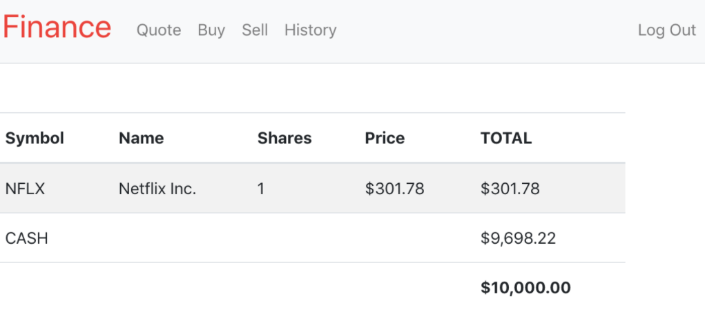

# Finance

It's a web app by which users can manage portfolios of stocks. This will allow
users to check real stocks' actual prices and via this app they can buy and sell stocks.

Project description: <a href="https://docs.cs50.net/2019/x/psets/8/finance/finance.html">Finance</a>

# prototype

